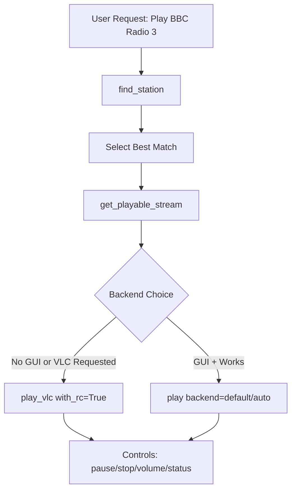

# MCP Radio Browser Server 🎵📻

An [MCP](https://modelcontextprotocol.io) server that lets your LLM **search**, **resolve**, and **play** internet radio stations.

It uses the [Radio Browser](https://www.radio-browser.info) open API for station discovery and direct stream URLs, so there are **no API keys** or scraping required.  
Playback works via:
- The **OS default media player** (cross-platform)
- **VLC** (with optional remote control for pause/stop/volume/status)

---

## ✨ Features

- **Search** for stations by name, country, and tags.
- **Resolve** playlists/redirects into direct audio stream URLs.
- **Play** streams in your default player or VLC.
- **Control VLC** playback (pause/resume, stop, volume, status) via its RC interface.
- **Environment probing** (`check_players`) to decide the best playback backend automatically.
- Designed to work seamlessly with LLMs via MCP.

---

## 📂 Repository Structure

```
.
├── server.py                 # Main MCP server implementation
├── requirements.txt          # Python dependencies
├── add_to_system_prompt.txt  # Paste this into your LLM system prompt for correct tool usage
└── README.md                 # This file
```

---

## 🚀 Quick Start

### 1. Clone and set up

```bash
git clone https://github.com/yourusername/mcp-radio-server.git
cd mcp-radio-server
python -m venv .venv
source .venv/bin/activate   # or .\.venv\Scripts\activate on Windows
pip install -r requirements.txt
```

### 2. Run the server

```bash
python server.py
```

By default this runs with MCP’s standard I/O transport (ready for connection to an MCP-aware LLM client).

---

## 🛠 Tools Exposed to the LLM

| Tool | Purpose |
|------|---------|
| **`find_station(query, country?, tag?, limit=10)`** | Search Radio Browser for stations. |
| **`get_playable_stream(url)`** | Resolve playlists/redirects to a direct audio stream. |
| **`play(url, backend="auto"\|"default"\|"vlc", force_playlist=true)`** | Play a stream using OS default player or VLC. |
| **`play_default(url, force_playlist=true)`** | Open in OS default handler (writes `.m3u` if forced). |
| **`play_vlc(url, with_rc=false, rc_host="127.0.0.1", rc_port=4212)`** | Launch VLC, optionally enabling RC interface for later control. |
| **`check_players()`** | Return `{has_gui, vlc_available, platform}`. |
| **`vlc_pause()`** | Toggle pause/resume in VLC. |
| **`vlc_stop()`** | Stop playback in VLC. |
| **`vlc_volume_set(percent)`** | Set VLC volume (0–100%). |
| **`vlc_volume_change(delta)`** | Adjust VLC volume by +/- percent. |
| **`vlc_status()`** | Return VLC’s current RC status output. |

---

## 🧠 Connecting to Your LLM

1. Open `add_to_system_prompt.txt`.
2. Paste its contents into your LLM system prompt **before** starting a conversation.
3. The text tells your LLM:
   - How to chain the tools (`find_station` → `get_playable_stream` → `play`).
   - When to use VLC (and enable RC for controls).
   - How to handle disambiguation and playback issues.

---

## 💻 Example Interactions

### Play a station (desktop GUI)  
**User:**  
```
Play BBC Radio 3
```  
**LLM tool calls:**  
1. `find_station("BBC Radio 3", country="United Kingdom")`  
2. `get_playable_stream(url="<best match>")`  
3. `play(url="<resolved>", backend="auto")`  

---

### Play with VLC and control  
**User:**  
```
Play Classic FM using VLC
```  
**LLM tool calls:**  
1. `find_station("Classic FM", country="United Kingdom")`  
2. `get_playable_stream(url="<best match>")`  
3. `play_vlc(url="<resolved>", with_rc=True)`  

Later:  
- `vlc_pause()`  
- `vlc_volume_set(60)`  
- `vlc_stop()`

---

### Check environment  
**User:**  
```
Check my audio player options
```  
**LLM tool calls:**  
`check_players()` → `{has_gui: true, vlc_available: true, platform: "darwin"}`

---

## 📊 Flow Diagram



---

## 🔧 Notes

- **VLC Control:** For pause/stop/volume tools to work, VLC must be started with RC enabled (`with_rc=True` in `play_vlc`).
- **Default Player Mode:** `play_default` writes a `.m3u` file when `force_playlist=True` so the OS is more likely to hand it to a media player instead of a browser.
- **Station Coverage:** Radio Browser has excellent global coverage. If a station isn’t found, consider adding other open directories like Icecast.

---

## 📜 License

MIT License. See [LICENSE](LICENSE) for details.

---

## 🙌 Credits

- [Radio Browser](https://www.radio-browser.info) for the free, open station directory.
- [Model Context Protocol](https://modelcontextprotocol.io) for the MCP tooling framework.
